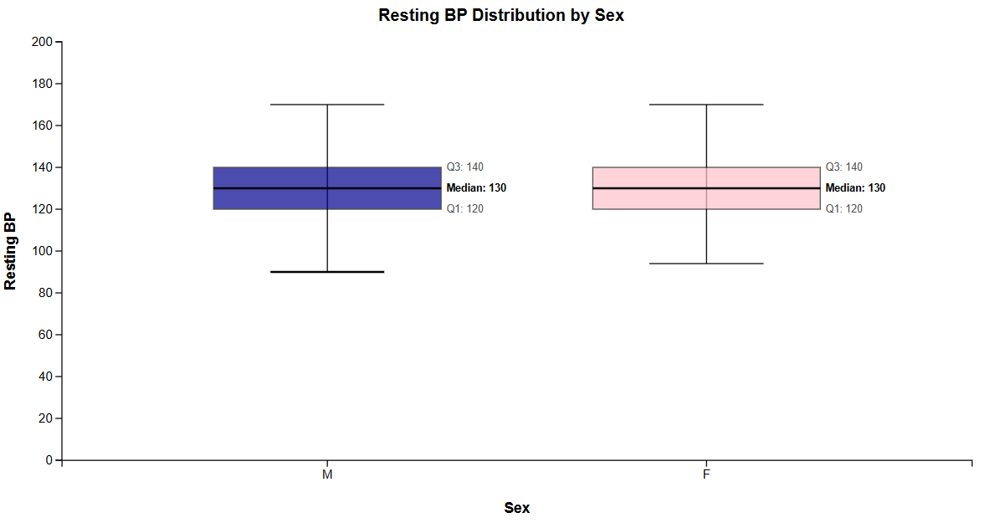

# Data Visualization Project

## Abstract
This is a report about a CS 573 Data Visualization project for Abhiram Yammanuru. There is information below regarding Data, Questions and Tasks, Sketches, Prototypes, as well as milestones. 

## Introduction
Heart disease is a prevelant condition that takes the lives of numerous people yearly. There are factors that can impact the likelihood of one to have this condition. This analysis takes a dataset from kaggle and has 4 graphs that aim to draw conclusions on how differetn factors affects heart rates. The graphs utilized here are scatter plots, bar charts, box and whisker plots as well as a correlation matrix. Different iterations of those graphs can be seen below, in addition to the thought process behind all of the changes that have been made. 

## Data

The data I propose to visualize for my project is a dataset that is about cholestrol and heart faliures. I want to gain more insight on how different factors impact resting heart rate, cholestrol and blood pressure. The dataset itself has a few features, and a description of each of them can be seen below. 

Link to dataset: (https://www.kaggle.com/datasets/fedesoriano/heart-failure-prediction)

1. Age: This is the age of the patient (int)
2. Sex: This is the sex of the patient (str)
3. ChestPainType: This is the type of chest pain the patient has (str)
4. RestingBP: This is the resting blood pressure of the patient (int)
5. Cholestrol: This is the serum cholestrol for the patient (int)
6. FastingBS: This column determines if the fasting blood sure is above a threshold, 1: if FastingBS > 120 mg/dl, 0: otherwise (int)
7. RestingECG: This has the resting electrocardiogram results. It places users into buckets, either Normal, ST (which is abnormal) or LVH which is also abnormal. (str)
9. MaxHR: This is the maximum heart rate for each person (int)
10. ExcerciseAngina: This is if the person has exercise-induced angine (bool)
11. OldPeak: Essentially comparing the ventricles of the heart contracting and recovering, and measuring how this is compared to the baseline. (float)

## Questions & Tasks

The following tasks and questions will drive the visualization and interaction decisions for this project:

 * What is the impact of being a certain gender on the resting heart rate?
 * How does age impact cholestrol levels?
 * How does age impact resting heart rate?
 * How does age impact blood pressure?

## Sketches

These are some graphs that I have sketched, and are the graphs that I plan on adding to my portfolio. 

This is another graph I sketched in ms paint. 

## Prototypes

Firstly, I’ve created a proof of concept visualization of this data. It's a bar chart and it shows Males vs Females with their resting heart rate. 

(https://vizhub.com/abhiyam/550f22fa080345c8bd8d1e511e6e201b)

As the weeks have went on, I have updated this prototype, this prototype is now interactive when you click on each bar plot, and now also contains a legend for the user to determine which colors are male and female. When clicking male, it makes female dim and vice versa to further highlight each bar graph. This can be seen below. 

(https://vizhub.com/abhiyam/4378e51ef542465f8e9486b87e36d2ee)

In addition, to further increment this, I added a method so that the Y axis can be more interactive and be changed, to further show the comparison between gender. I aim to add this to all of my prototypes eventually so that the user can compare the same data with different kind of graphs and different comparisons between the variables.

(https://vizhub.com/abhiyam/33ddc312c5ca4ae1be4fa196b1908de3)

Below can be seen my first implementation of the scatter plot between how age impacts cholestrol levels, it can be seen below. It is very rough in the way that it sketches, due to it overlapping with the axes as well as not having a legend with gender. 

Here is the iteration for the previous proof of concept visualization. This is also a scatter plot of how age impacts cholestrol levels. Compared to the previous prototype, I added labels to determine which of the datapoints are different genders. Additionally, for making progress on this, I was able to add an interactive legend to the graph, which makes it more user friendly. 

I've made 2 additional iterations to this visualization. The scatter plot here has smaller dots in order to make it more visually appealing. 

(https://vizhub.com/abhiyam/d5381425142d44dab3e8a9ca620ef781)

The final iteration that can be seen is once again the interactive Y-axis. This is soemthing that I have implemented in all of the other graphs so I wanted to include it here too. It can be seen below.

(https://vizhub.com/abhiyam/9ec12ee2c4ec488fb6af3f4c1fd2fea5)

Here is the 3rd proof of concept visualization. This is a boxplot of the relationship between age and resting blood pressure. 

(https://vizhub.com/abhiyam/da13a347c64f425f8058c700cca1f48c)

I have further incremented on this 3rd proof of concept visualization by adding more interactivity within it. This boxplot now can cycle between different Y axes, so that the user can compare the different variables. Additionally, it now also includes hovering, so that the user can highlight specific parts of the boxplot. Overall, it is a solid step up from the previous prototype. 

(https://vizhub.com/abhiyam/80db9a7bbcfb4018b7a12ff7d59000b5)

Another prototype that I have is a correlation matrix between the numerical variables, this is something that is interesting to see how they interact with each other. I used a color gradient of pink and green to show how related each of the variables are to each other. 

(https://vizhub.com/abhiyam/da6a56cba242436bb003962f1a2217d1)

## Open Questions

Some of my initial worries can be seen below:
I think one thing I am worried about is thinking if my plot is too simple from drawing conclusions or making interpretations. Its just a bar plot that compares the 2 sexes. However, I know that there will be 2 other visualizations that I want to make, so I'm not too worried about it. 

As the term has gone on, I am less worried about this due to the interactivity elements, as well as the ability to have multiple graphs with the ability to change the Y axis. 

## Milestones

September: Finish up visualization 1 and 2
October: Finish up visualization 3 and 4
November: Maybe add some interactive elements?
December: Finalizing Porfolio and polishing it up

## Conclusion
To conclude, some insights that can be derived from these graphs include that age, cholestrol level and blood pressure are all related to each other in some ways or another. There is also a negative correlation between age and cholestrol level, as well as a negative correlation betwen max heart rate and having heart disease. Surprisingly, according to this dataset there isn't much differences between the 2 genders when it comes to blood pressure or cholestrol levels, which is something to look into the future. 
